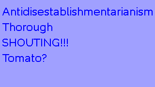

# BMText

Render text with [BMFont](https://www.angelcode.com/products/bmfont/) generated bitmap fonts.

**Status**: The core of this code is reasonably well tested, but it's at an early stage, it's basically just been thrown up online, and you use it at your own risk.

## Why???

I wanted kerning, and I wanted support for a widespread bitmap font format. BMFont is used to generate bitmap fonts from Truetype fonts, and the format it uses seems reasonably well supported.

I have vague plans to extend the format slightly to allow pre-rendered glyphs - so characters could
be multi-colored or embossed, for example.

## Using it

Install it with:

```bash
python -m pip install bmtext
```

Currently the API matches ImageDraw.text as closely as possible (given the limited feature-set).

```python
from PIL import Image
from bmtext.meta import parse_file
from bmtext.pil import BMText

im = Image.new('RGB', (320, 180), color=(160, 160, 255))
drawer = BMText(im)
font = parse_file("tests/fixtures/raleway-30/raleway-thin-32.fnt")
# FIXME: Overlapping glyphs remove part of previous char.
drawer.text((5, 5), "Antidisestablishmentarianism\nThorough\nSHOUTING!!!\nTomato?", font, fill='blue')
im.show()
```



## To Do
* FNT Compatibility:
    * Handle binary font metadata formats.
    * Test with multiple pages
    * Multiple channel support
    * Outline support (2-pass rendering)
* Improve error handling:
    * Malformed fnt files
    * Missing characters from font (replace/error)
* Features:
    * Allow arrangement of pre-rendered characters (rather than single-color alpha characters).
    * Implement textsize
    * Implement alignment
    * Implement anchor
* More testing:
    * Test with older versions of pillow
* Port to Python 3.5+ (remove the walrus operator)


## Developing

Run the following to install the project (and dev dependencies) into your active virtualenv:

```bash
pip install -e .[dev]
```
